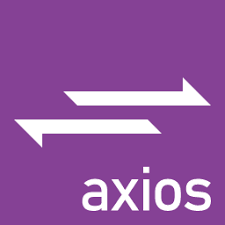

# React Dental Clinic

This project is a Dental Clinic Web made with React using the Backend from another project
The web is completely responsive. In the page you can register, you have access to your appointments management, in case you are using and admin profile you will have full access to all the information.

Find me on:
 <a href="https://www.linkedin.com/in/jos%C3%A9-manuel-ruiz-ruiz-07b262182/">LinkedIn</a>
 <a href="https://github.com/joserr98/">GitHub</a>
 

You can check it out here: <a href="https://dental-clinic-frontend.vercel.app/">Project link</a>

Technologies used:

 

### Info
Admin
email: jose@mail.es
password: admin

In case you do not want to register, you can use:
email: juan@mail.es
password: 12345

### Home

### Register and login forms

### Users list (admin board)

### Appointments list (admin view)

### User profile

# Inquires 

<a href="https://www.linkedin.com/in/jos%C3%A9-manuel-ruiz-ruiz-07b262182/"> Jose's linkedin </a>